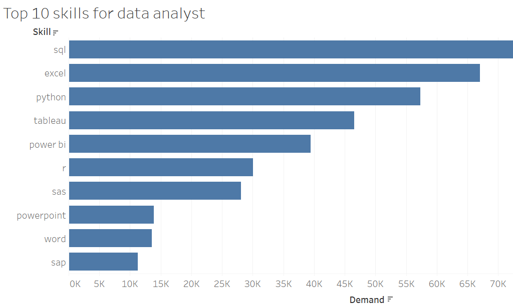

# introduction
This repository contains SQL queries that analyze data-related job postings to provide insights into the job market. The analysis focuses on identifying high-paying roles, in-demand skills, and trends in the data field.

# Queries Included
## 1. First Quarter Tables
### Purpose
 Examines job postings from the first quarter to identify early-year hiring trends in data roles

 ### Key Insights
Shows which companies were most active in Q1 and what roles were in demand

[First quarter tables](sql_querys\first_quarter_tables.sql)

## 2. Most Paying Jobs

### Purpose: 
Identifies the highest-paying data-related positions

### Key Metrics
- Average salary by job title
- Salary ranges for top positions
- Companies offering the highest compensation

 [Top Paying Jobs](sql_querys/most_paying_jobs.sql)

## 3. Top 10 Skills for Data Analysts

### Purpose 
Reveals the most frequently required skills for Data Analyst positions

### Key Findings
- Technical skills (SQL, Python, etc.)
- Visualization tools (Tableau, Power BI)
- Soft skills and methodologies

[Top 10 skills for data analyst](sql_querys/top_10_skills_for_data_analyst.sql)

## 4. Top Paying Jobs Skills
### Purpose 
Cross-references high-paying jobs with their required skills

### Key Insights 
Shows which skills correlate with higher compensation

[Top paying jobs skills](sql_querys/top_paying_jobs_skills.sql)

## 5. Top Paying Skills
### Purpose
 Identifies specific skills that command premium salaries

### Key Findings

- Specialized skills with salary premiums

- Skill combinations that increase earning potential

[Top paying jobs](sql_querys/top_paying_skills.sql)

## 6. Data Sources
 Queries are designed to work with job posting data that includes:

- Job titles

- Salary information

- Required skills

- Company information

- Posting dates

- And more

# Cunclusion

 In the end we find,  Data is the backbone of modern decision-making, and roles like **Data Analysts, Scientists, and Engineers** are pivotal in transforming raw information into actionable **insights**. Whether it’s through SQL queries, Python automation, or dynamic dashboards, the goal remains the same: **drive impact with data**.